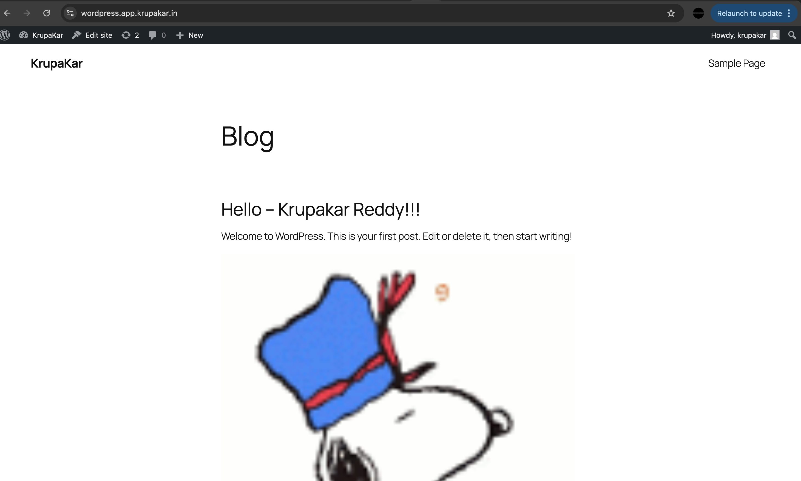

# ECS Assignment Project

This project implements a robust AWS infrastructure using ECS (Elastic Container Service) with Application Load Balancer, RDS database, and AWS Secrets Manager integration.

[Assignment](./ecs-microservice/assets/assignment.png)

## Usage:

-  create modules for required services
 - VPC, RDS, ECS.

- First spin up the `vpc`, it's the primary base for provisioning the service in private subnets
  - enter vpc under root folder, perform terrraform init and apply with required inputs feed in `vars.tf`

- Secondly, spin up the `rds` service that will create instance of mysql enginer (wordpress supports mqsql or mariadb),
  - enter rds folder and perform terraform commands, this will create instance and stores the `db-creds` in ## secrets-manager.

- Third, start provisioning the services, we can start creating services of `ecs-wordpress` and `ecs-microservice`

Finally, 

----