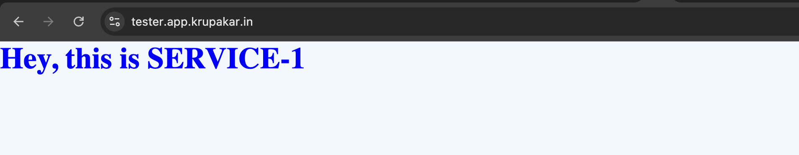

# ECS Service -  Microservice

This ECS-microservice which is using from modules/ecs configuration, this will provision the ecs service in existing ecs cluster, if there is no ECS cluster avialble you need to create it first.

- make sure you are already place vpc name to place your cluster on required private subnets.
- This will spin up the normal nginx image will is attached to ALB and connected dns.
- SSL is configured automatically issued by Certificate manager
- this will also configure the autoscaling for cpu and memory thresholds.

## Features

- Creates an ECS cluster and task definition.
- Deploys the ECS service in private subnets within the specified VPC.
- Configures the service to use Fargate as the launch type.
- Automatically fetches private subnets based on the provided VPC name.
- Sets up autoscaling based on CPU and memory thresholds.
- Attaches the ECS service to an ALB with HTTP to HTTPS redirection.
- Configures DNS records in Route 53 with SSL certificates issued by ACM.
- Creates required IAM roles, including CloudWatch log stream policies for logging.

## Usage

- Make sure you execute the terraform commands in this root directory (ecs-microservice)
- check `vars.tf` file to place your required inputs such your `hosted_zone id`, `dns name` and other reuqired vars.
- start `terraform init` - this will  initialize the module and required plugins.
-  `terraform plan` - will provide you the blue-print of your infra services to be create.
- ` terraform apply` - will provision the ecs and configure the dns e2e.

- once you're are provisioned, you should be seen this - 

Microservice

!!!

